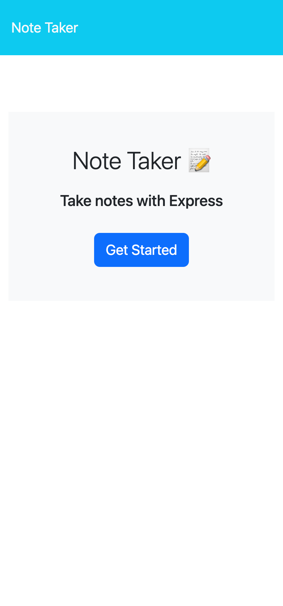

# Note-Taker

### Description

This assignment is to reinforce knowledge regarding express.js and routers. It also shows how to connect front-end and back-end. Multiple routers were used such as GET, POST, and DELETE. You can visit the app by [(Click Here)](https://mysterious-sierra-92317.herokuapp.com/). 

---

## Table of Content

- [License](#license)
- [Questions](#questions)

---

## License

Please visit [License link](https://choosealicense.com/licenses/mit/)

## Questions

Feel free to submit your questions under the ISSUES of the repository [(Click Here to Visit My Github Page)](https://github.com/jabezli)

- 
